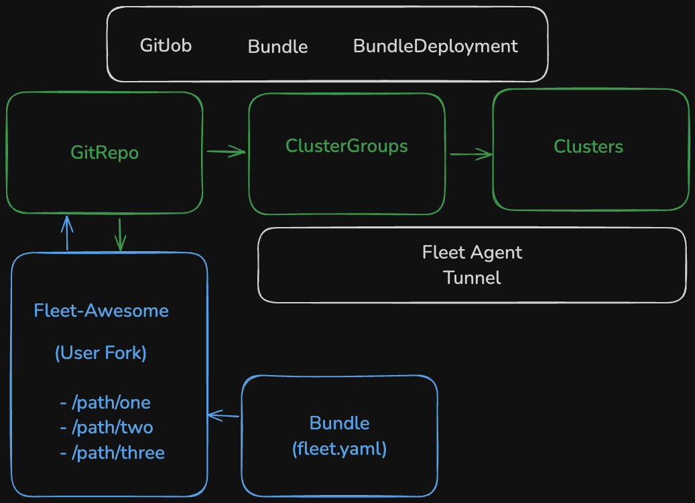

## Fleet Awesome

A curated list of minimal reproducible examples, usable via SUSE Rancher Fleet. All assets are quick and minimal, focusing on a local lab environment. Customization with flexible config through secrets or downstream cluster `ConfigMap` objects. By default the options for the Bundles, _or snippets, recipes,_ are opnionated towards operational efficiency, proof-of-concepts or pilot experiments.
Unlike other "awesome-something" lists, the role of Fleet is as a facilitator for gitops operations with the repository using fleet-focused conventions and formatting.

## QuickStart

#### Git ####
 * Fork the repository
 * Add a git remote with a unique name for your new fork
 * (Optional) Create a branch for your changes and testing
 * (Optional) Create Pull Requests (PRs) in GitHub for submitting your branch changes

#### Fleet ####
 * If you have Rancher installed, you already have a Fleet Controller on the Local Cluster
   * The UI option for Continuous Delivery is Fleet's _"SailBoat"_ icon
   * connections established to Downstream Clusters with their Fleet-Agent
 * For each project, create one or more `GitRepo` resources, see `GenericExample-ClusterGroup.yaml` and `GenericExample-GitRepo.yaml` in the main repo root folder
   * more examples under `/misc/location/parslab/sublevel/fleet-controller`
 * Each GitRepo can have one or more paths to where the recipes live under your new forked repo
 * Assign `Clusters` (`clusters.fleet.cattle.io`) to `ClusterGroups` with labels
   * Fleet pulls the repo data with a `GitJob`, then creates `Bundles` from `fleet.yaml` files for HelmCharts & Kustomizations
 * Final result is a `BundleDeployment` sent and deployed by the fleet-agent in the Downstream cluster for the target defined in the `ClusterGroup`
   * Here _Target_ is a reference to a downstream Cluster and/or Namespaces on that cluster, depending on wether `Bundles` need to deploy namespaced or cluster-wide resources

_CRD Flow_

Each snippet or recipe relies on Fleet CRDs to generate and deilver a `Bundle` to the target `Clusters`. 
 * See the Fleet CRD workflow outlined in the diagram below.

See the Fleet docs about [bundle lifecycle stages](https://fleet.rancher.io/ref-bundle-stages) for more information.
  
## Category Structure

 * _Infra_ - infrastructure-related assets, including CNI configurations, K8s distributions, dual-stack, and ingresses.
 * _Misc_ - any example or asset that does not fit into other categories, or upstream open source projects that might be covered in AppCo.
 * _Security_ - security-focused and other related topics, secrets, service mesh, mtls.
 * _Storage_ - CSI-related assets, homelab-focused storage options like minio and NFS.
 * _Vendor_ - any vendor-specific assets which may or may not be open source, or have a vendor-component in the asset, manifests, or charts.  The primary example is Application Collection.

### Features
 
 * Avoid longer names for labels and charts with a 63 character limit. Achieved through `helm.releaseName` option.
 * Avoid clobbering existing resources, through use of `helm.takeOwnership: false` option, for example when a Bundle is deployed into a pre-existing Namespace.
 * Use of Kustomization configuration options for safer deployment and targeting.
 * Day Two operations respecting existing Namespaces, Secrets and ConfigMap resources for targeted ClusterGroups.

## TODO: March 2025

- [x] collect and organize initial configurations and charts/manifests/kustomizations
- [x] set up gitjob-webhook, no polling for fleet. URL: `info.kubefred.com`, over cloudflared tunnel
- [x] commit the current/inital working dir tree into gitlab
- [x] 100+ assets represented
- [x] High-Level Executive Summary (needs polish)
- [x] submit various Bundles for testing, using clusters in homelab (Parslab), `GitRepo`... deploy - test - remove (ongoing)...
- [x] polish summary page with blurb and longer description, short description in the repo
- [x] evaluate project mapping, content organization, group naming conventions, subsystem repo structure (ongoing)
- [x] document TODOs and READMEs for every current asset, flag some for removal (ongoing)
- [x] public oci image/repo for helm charts (haproxy-ingress)
- [x] ~secrets &~ configmap `ValuesFrom` fleet.yaml bundle options, [see the docs](https://fleet.rancher.io/gitrepo-content#using-valuesfrom) for next-steps variable templating in April
- [x] use `helm.releaseName` in fleet-bundles to overcome hurdle of long (>63 char) chart/release names 
 
## TODO: April 2025
 
- [x] Edit: focus on secrets' workflow ... ~secrets `valuesFrom` in addition to ConfigMap~ 
- [x] separate development bootstrap workflow, secrets, infra, etc
- [x] ~Secrets management, downstream config separation, general-assets~ ... next variable templating bootstrap validation

## TODO: May 2025

- [x] ~quickstart (done)~ and CRD flowcharts explainations as mini "how-to"
- [ ] var templating, signatures, ci-workflow support bootstrap validation
- [ ] Component Testing, Automation (generic CI), QA functionality
- [ ] CI Pipeline, inter-team collaboration, possible presentation, PR/Forks of repo content
- [ ] Future training videos or offline videos, consistent new assets like Elemental, GatewayAPI, ClusterAPI
- [ ] wrap-up and enduser testing, teammate feedback

...
